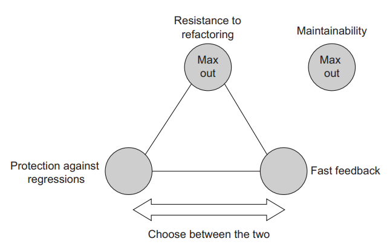
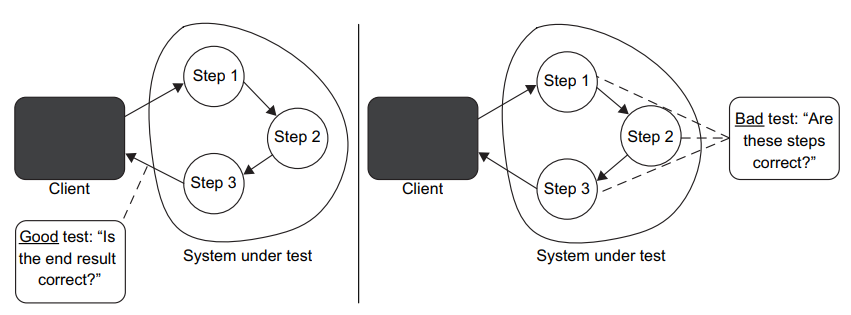

A good unit test has the following four attributes:
- Protection against regressions
- Resistance to refactoring
- Fast feedback
- Maintainability

These four attributes are foundational. You can use them to analyze any automated
test, be it unit, integration, or end-to-end. Every such test exhibits some degree of
each attribute

# Pillar 1: Protection agains regressions
This can be explained as: how good is this test at catching bugs. To evaluate how well a test scores on this metric you need to take into account the following:
* The amount of code that is executed during the test
* The complexity of that code
* The code's domain significance

Generally, the larger the amount of code that gets executed, the higher the chance
that the test will reveal a regression. Of course, assuming that this test has a relevant
set of assertions, you don't want to merely execute the code. While it helps to know
that this code runs without throwing exceptions, you also need to validate the outcome it produces.

# Pillar 2: Resistance to refactoring
The second attribute of a good unit test is resistance to refactoring—the degree to which
a test can sustain a refactoring of the underlying application code without turning red (failing).

Picture this situation. You developed a new feature, and everything works great. The
feature itself is doing its job, and all the tests are passing. Now you decide to clean up
the code. You do some refactoring here, a little bit of modification there, and everything looks 
even better than before. Except one thing—the tests are failing. You look
more closely to see exactly what you broke with the refactoring, but it turns out that
you didn't break anything. The feature works perfectly, just as before. The problem is
that the tests are written in such a way that they turn red with any modification of the
underlying code. And they do that regardless of whether you actually break the functionality itself.
 
This situation is called a false positive. A false positive is a false alarm. It's a result
indicating that the test fails, although in reality, the functionality it covers works as intended. 
Such false positives usually take place when you refactor the code—when
you modify the implementation but keep the observable behavior intact. Hence the
name for this attribute of a good unit test: resistance to refactoring.

Think of your code as a black box. Hide as much variables and methods as possible. 
Your test should only couple to the end-result of your system under test, 
not to it's underlying intermediate results and implementation details.

# Pillar 3: Fast feedback
Fast feedback is an essential property of a unit test. 
The faster the tests, the more of them you can have in the suite and the more often you can run them.
 
With tests that run quickly, you can drastically shorten the feedback loop, to the
point where the tests begin to warn you about bugs as soon as you break the code, thus
reducing the cost of fixing those bugs almost to zero. On the other hand, slow tests
delay the feedback and potentially prolong the period during which the bugs remain
unnoticed, thus increasing the cost of fixing them. 
That's because slow tests discourage you from running them often, 
and therefore lead to wasting more time moving in a wrong direction.

# Pillar 4: Maintainability
Finally, the fourth pillar of good units tests, the maintainability metric, evaluates
maintenance costs. This metric consists of two major components:
- _How hard it is to understand the test_ —This component is related to the size of the
test. The fewer lines of code in the test, the more readable the test is. It's also
easier to change a small test when needed. Of course, that's assuming you don't
try to compress the test code artificially just to reduce the line count. 
The quality of the test code matters as much as the production code. Don't cut corners
when writing tests; treat the test code as a first-class citizen.
- _How hard it is to run the test_—If the test works with out-of-process dependencies,
you have to spend time keeping those dependencies operational: reboot the
database server, resolve network connectivity issues, and so on. 